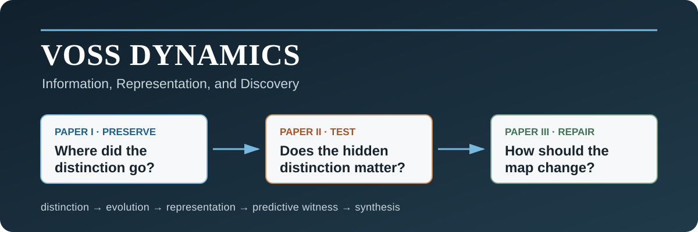

  

  
  
  

> **The three studies address one problem from successive directions: how differences between possible states are preserved by dynamics, collapsed by representation, tested for predictive significance, and recovered when the current representation proves insufficient.**

A representation does more than compress a system. It decides which possible histories count as the same.

**Voss Dynamics** studies the preservation, representation, and recovery of information-bearing distinctions. Its fundamental object is a difference between two possible states or histories; its central question is what happens to that difference under evolution, observation, prediction, and reconstruction.

## Read the complete work

**[Voss Dynamics: Information, Representation, and Discovery](./series/Voss-Dynamics-Information-Representation-and-Discovery.pdf)** is the formal single-volume edition, with all three papers in sequence.

| Study | The question | The move | Start here |
|---|---|---|---|
| **I. The Principle of Full Invertibility** | Where, exactly, did a distinction become merged or inaccessible? | Separate dynamical evolution, observation fibres, numerical access, inverse branches, and boundary operations. | [Paper I PDF](./%281%29%20The%20Principle%20of%20Full%20Invertibility/The_Principle_of_Full_Invertibility.pdf) · [source and evidence](./%281%29%20The%20Principle%20of%20Full%20Invertibility/) |
| **II. Emergent Predictive Representation** | Can distinctions hidden by the current representation change future predictions? | Turn predictive sufficiency into a bounded, falsifiable question; distinguish redundant fibres from candidate physical memory. | [Paper II PDF](./%282%29%20Emergent%20Predictive%20Representation/Emergent-Predictive-Representation.pdf) · [claim ledger](./%282%29%20Emergent%20Predictive%20Representation/CLAIM_LEDGER.md) |
| **III. Pressure-Driven Invariant Synthesis** | What should happen when the representation fails? | Make the map dynamic: meaningful collisions pressure a typed, nuisance-invariant search to synthesize and append a new observable. | [Paper III PDF](./%283%29%20Pressure-Driven%20Invariant%20Synthesis/Pressure-Driven-Invariant-Synthesis.pdf) · [engine and evidence](./%283%29%20Pressure-Driven%20Invariant%20Synthesis/) |

## The progression

Let a complete state or history be $x$, its dynamics be $\Psi$, and its representation be $\mathcal O$.

~~~text
Paper I                  Paper II                         Paper III

x ──Ψ──▶ x⁺ ──O──▶ y    O(x) = O(x′), but               collision under Oₖ
                         future(x) ≠ future(x′)            │
                                                         ▼
which map merged         does the hidden                 synthesize fₖ
the distinction?         distinction predict?             │
                                                         ▼
                                                   Oₖ₊₁ = (Oₖ, fₖ)
~~~

That sequence is the project’s core claim: **preservation must be located, insufficiency must be witnessed, and repair must be earned by the collision that exposed the failure.**

## Results worth opening the papers for

### I — a provenance calculus for information loss

- For the drift–kick realization, the smooth-stratum Jacobian factors as
  $$
  \det D\Psi=\gamma^{2N}\det D_\phi G_{\mathbf r^+},
  $$
  so the force Jacobian cancels from the determinant.
- Local nonsingularity and global invertibility are separated: an explicit target has three phase preimages.
- A finite census maps **160 complete states to 103 descriptions** while all checked shared-description states remain dynamically distinct.
- Transition folding, observation fibres, finite-precision access, and boundary clipping receive different mathematical types instead of one overloaded story about “loss.”

### II — predictive sufficiency becomes falsifiable

- A normalized nontrivial stationary real pointer has a two-dimensional irreducible cyclic span.
- Under an explicit response-completeness axiom, matching that span to the binary QND-filter algebra forces
  $$
  2=1+\frac{d(d-1)}2 \quad\Longrightarrow\quad d=2,
  $$
  conditionally selecting the complex Hermitian family.
- The pure-spinor map $\psi\mapsto\psi\psi^\dagger$ has a $U(1)$ fibre, while the ideal QND transverse invariant is already encoded in $\rho$.
- VD-Hopf-1 is kept separate as a candidate closed-history memory law with an explicit $\varepsilon=0$ null. **No physical deviation from quantum mechanics is claimed.**

### III — the representation itself learns from failure

- Append-only augmentation provably refines exact fibres; with a fixed max metric, threshold-collision sets are nested.
- A separator-complete search reaches injectivity on a finite sample after at most $n-c_0$ successful splits—conditional, finite-sample, and not a population theorem.
- The released 271-program engine actually reinserts its selected unary observable and passes invariance, noise, source-audit, AUC, and complexity gates.
- On independent synthetic audits, macro collision risk falls from **0.969 to 0.183** (absolute reduction **0.786**).
- In every leave-one-system-out fold, a 99-repetition full-pipeline source-label null selects **0 programs in 99 runs**.
- The boundary matters: the admissible random-program comparator is beaten significantly in only one of three systems, and the frozen expression does **not** transfer significantly to ECGFiveDays or Earthquakes.

The strongest result is not “universal invariant discovery.” It is a disciplined mechanism: a meaningful collision can become a counterexample, a counterexample can generate an interpretable repair, and an honest outer audit can say where that repair stops working.

## Evidence, not decoration

Each paper separates claim classes:

| Status | Meaning |
|---|---|
| **Proved** | Follows from stated assumptions. |
| **Computed** | Reproduced by deterministic algebra, code, or seeded simulation. |
| **Held out / candidate** | Evaluated after an internal freeze, or specified as a falsifiable law; neither means established in Nature. |
| **Open** | Requires stronger theory, new data, prospective commitment, or independent replication. |

The cross-paper [claim map](CLAIM_MAP.md) links the major statements to their evidence and failure conditions, and the root [release manifest](MANIFEST.sha256) pins every committed file. Paper III additionally preserves its [failed development null](./%283%29%20Pressure-Driven%20Invariant%20Synthesis/evidence/DEVELOPMENT_AUDIT.md) and a [forensic audit of the superseded engine](./%283%29%20Pressure-Driven%20Invariant%20Synthesis/evidence/LEGACY_ENGINE_AUDIT.md). The legacy seismic pilot is excluded from Paper III’s empirical totals. Its two UCR stress-test archives are retrieved from official URLs by a checksum-enforcing downloader rather than redistributed.

## Reproduce

Every paper ships its source and evidence. The shortest executable checks are:

~~~bash
# Paper I
cd "(1) The Principle of Full Invertibility"
uv sync --frozen
uv run python evidence/thesis_verification.py

# Paper II
cd "../(2) Emergent Predictive Representation"
uv sync --frozen --all-groups
uv run pytest -q

# Paper III
cd "../(3) Pressure-Driven Invariant Synthesis"
uv sync --frozen
uv run pytest -q
shasum -a 256 -c evidence/outputs/manifest.sha256
~~~

Paper III’s complete evidence run is computationally heavier:

~~~bash
uv run python evidence/run_all.py
~~~

See [REPRODUCIBILITY.md](REPRODUCIBILITY.md) for environments, build commands, expected outputs, archive hashes, and the exact meaning of “frozen.”

## Repository structure

~~~text
Voss-Dynamics/
├── (1) The Principle of Full Invertibility/
├── (2) Emergent Predictive Representation/
├── (3) Pressure-Driven Invariant Synthesis/
├── series/                         # unified three-paper volume
├── CLAIM_MAP.md                    # cross-paper result and evidence map
├── MANIFEST.sha256                 # exact release-integrity hashes
├── REPRODUCIBILITY.md
├── CITATION.cff
└── LICENSE
~~~

## Citation and license

Citation metadata are in [CITATION.cff](CITATION.cff). Original code is MIT-licensed; original manuscripts and documentation are licensed under CC BY 4.0. Third-party datasets, dependencies, and cited works retain their upstream terms. See [LICENSE](LICENSE) for the exact boundary.

---

<strong>Preserve the distinction. Test whether it matters. Repair the map when it fails.</strong>

